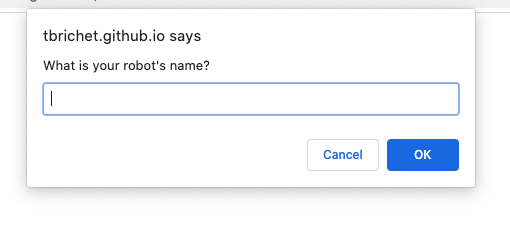

# Robot Gladiators
Lesson 3 Practice Assignment | JavaScript

## Student Name
Tara Brichetto

## Creation Date
10 August 2020

## Purpose
This application was created as a practice assignment for the University of Arizona bootcamp. Robot Gladiators is a basic game using core JavaScript concepts such as functions, loops, and conditional statements.

## Languages
* HTML  
* JavaScript  

## Links
* Github Repository | https://github.com/tbrichet/robot-gladiators  
* Deployed Application | https://tbrichet.github.io/robot-gladiators/  

## Screenshot
